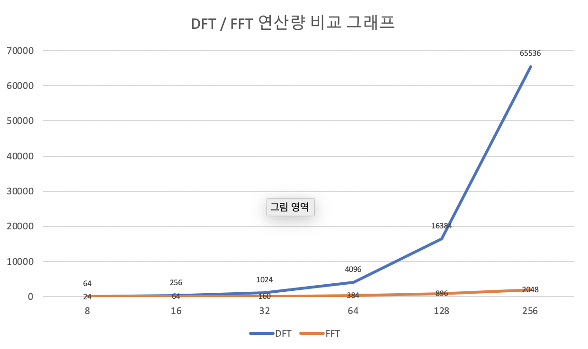
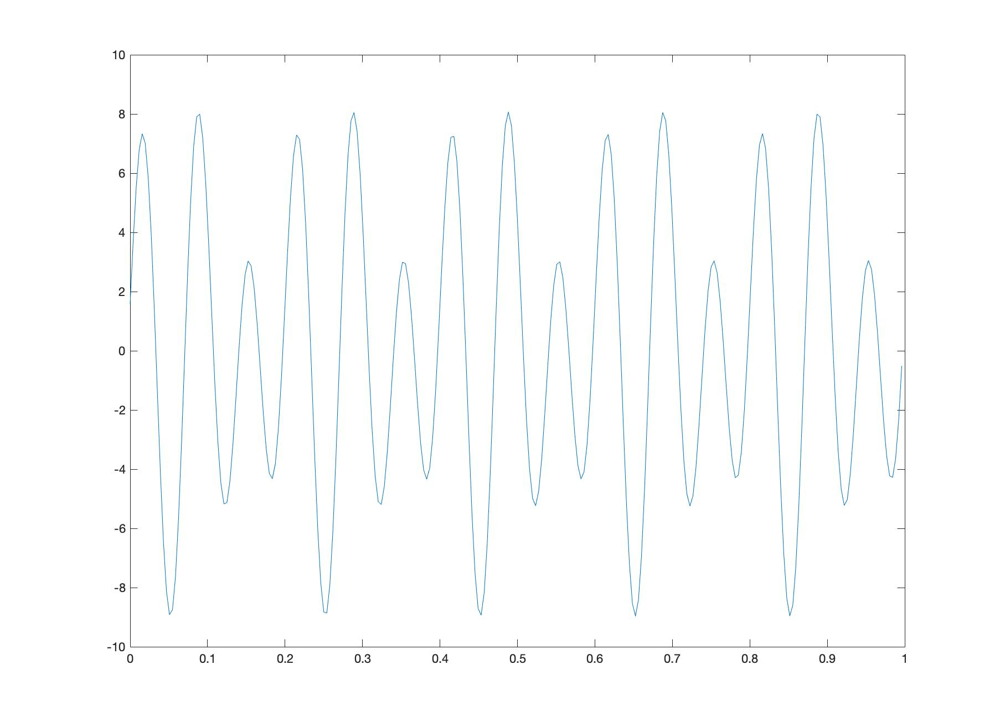
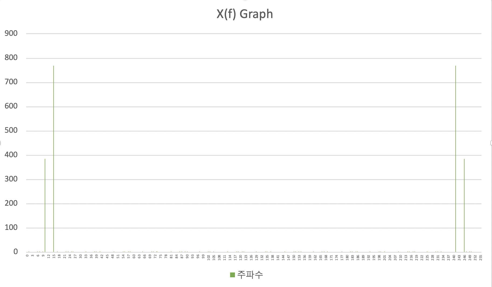

# Fast Fourier Transform, 고속 푸리에 변환  

FFT(고속 푸리에 변환, Fast Fourier Transform)은 DFT(이산 푸리에 변환, Discrete Fourier transform)과 그 역변환을 빠르게 수행하는 알고리즘이다.  
가장 잘 알려진 FFT 알고리즘은 Butterfly 알고리즘이라고 불리는 Cooley-Tukey 알고리즘이 있다.

1. 알고리즘 동작 방식     
   
    $$X[k] = \sum_{n=0}^{N-1}x[n]e^{-j \frac{2\pi}{N}kn} = \sum_{n=0}^{N-1}x(n)W_N^{kn}$$    

    $$W_N = e^{j\frac{2\pi}{N}}, \qquad\ 0 \le k \le N-1$$    

    여기서 $W_N^{kn}$은 주기성을 가지므로 같은 계산 값이 반복된다.  

    FFT는 입력 신호를 홀수번째와 짝수번째로 계속 분할(홀수번째에서도 입력순으로 홀/짝 분할, N=2가 될 때 까지 분할)한 후 각각의 분해된 신호의 FFT를 계산한다. 계산한 값들을 결합 하여 $X(k)$를 계산한다.  
      
    FFT는 분할정복을 통하여 계산하기 때문에 DFT보다 계산량을 줄일 수 있다. 계산량 비교는 2번에 작성하였다. 

   

2. Big O 표기법을 이용한 성능 분석
    DFT에서 $n$개의 점에 대해 계산을 할 경우 계산량은 $O(n^2)$이 나온다. sample point가 1000개라면 백만 번의 연산이 요구되는 것이다. 계산량에서 이러한 어려움을 극복하기 위해 FFT를 사용하며 이를 사용했을때 계산량은 $O(nlog_2n)$으로 줄일 수 있다. N값이 커질수록 FFT의 효율이 더 높아짐을 볼 수 있다.  
    

    

3. 알고리즘 코드 구현

```java
class Complex {
     private final double re;   // 복소수의 실수부
     private final double im;   // 복소수의 허수부

     // Complex 생성자 선언
     public Complex(double real, double imag) {
         re = real;
         im = imag;
     }

     // 복소수 덧셈 메소드. a+bi와 c+di의 덧셈은
     // 실수부는 a+c, 허수부는 b+d로 계산
     public Complex plus(Complex b) {
         Complex a = this;          
         double real = a.re + b.re;
         double imag = a.im + b.im;
         return new Complex(real, imag);
     }

     // 복소수 뺄셈 메소드. a+bi와 c+di의 뺄셈은
     // 실수부는 a-c, 허수부는 b-d로 계산
     public Complex minus(Complex b) {
         Complex a = this;
         double real = a.re - b.re;
         double imag = a.im - b.im;
         return new Complex(real, imag);
     }

     // 복소수 곱셈 메소드. a+bi와 c+di의 곱셈은
     // 실수부는 a*c - b*d, 허수부는 a*d - b*c로 계산
     public Complex times(Complex b) {
         Complex a = this;
         double real = a.re * b.re - a.im * b.im;
         double imag = a.re * b.im + a.im * b.re;
         return new Complex(real, imag);
     }
 }

 public class FFT {
     public static Complex[] fft(Complex[] x) {
         // n은 입력 신호의 개수
         int n = x.length;

         // base case
         if (n == 1) return new Complex[]{x[0]};

         // 샘플링 개수가 2의 제곱수가 아닐 경우 Exception 발생
         if (n % 2 != 0) throw new IllegalArgumentException("n is not a power of 2");

         // 짝수인 경우 처리
         Complex[] even = new Complex[n / 2];    // 샘플링 개수의 절반 크기 배열 생성
         // 생성한 배열에 입력 신호중 짝수번째에 입력된 신호 저장
         for (int k = 0; k < n / 2; k++) even[k] = x[2 * k];
         Complex[] evenFFT = fft(even);

         // 홀수인 경우 처리
         Complex[] odd = even;   // 위에서 생성해서 써먹었던 배열 가져옴
         // odd 배열에 입력 신호중 홀수번째에 입력된 신호 저장
         for (int k = 0; k < n / 2; k++) odd[k] = x[2 * k + 1];
         Complex[] oddFFT = fft(odd);

         // 분할 정복을 이용하여 버터플라이 계산 !
         Complex[] y = new Complex[n];
         for (int k = 0; k < n / 2; k++) {
             // W에서 e의 지수부분 계산해주기 -> 이걸로 주기성/대칭성 파악
             double kth = -2 * k * Math.PI / n;

             // cos함수로 실수부 계산, sin함수로 허수부를 계산주고 새로운 복소수 만들어서 wk에 저장
             Complex wk = new Complex(Math.cos(kth), Math.sin(kth));

             // 여기서부터 버터플라이 계산
             // N이 8일경우 짝수 FFT(P(0) ~ P(3))과 홀수 FFT(Q(0) ~ Q(3))을 더하는데
             // P(0)과 Q(0) 덧셈, P(1)과 Q(1) 덧셈, P(2)과 Q(2) 덧셈, P(3)과 Q(3) 덧셈을 차례로 저장
             // P(0)과 Q(0) 뺄셈, P(1)과 Q(1) 뺄셈, P(2)과 Q(2) 뺄셈, P(3)과 Q(3) 뺄셈을 뒤이어 저장
             // 이 코드에서는 for문을 돌려 빠르게 처리하기 위해 k번째 인덱스와 k + n/2번째 인덱스에 각각 덧셈 뺄셈 저장
             y[k] = evenFFT[k].plus(wk.times(oddFFT[k]));
             y[k + n / 2] = evenFFT[k].minus(wk.times(oddFFT[k]));
         }

         return y;       // 결과 리턴
     }
 }
```


4. x(t)= 3cos(20πt) + 6sin(30πt - 3/(4π)), 0 <= t <= 1에 대한 그래프와 이 신호를 주파수 변환한 X(f) 그래프 그리기
   
     
   
   샘플링 개수는 256개로 하였고, 매트랩에 있는 fft 라이브러리와 액셀(직접 값 입력)을 사용하여 그린 그래프이다.
x(t)의 그래프는 다음과 같다.  
     
   
   X(f)의 그래프는 다음과 같다.  
- MATLAB  
    _graph.jpg)  


   - Excel(재호오빠가 알려준 코드로 값 출력 후 차트화)  

     

